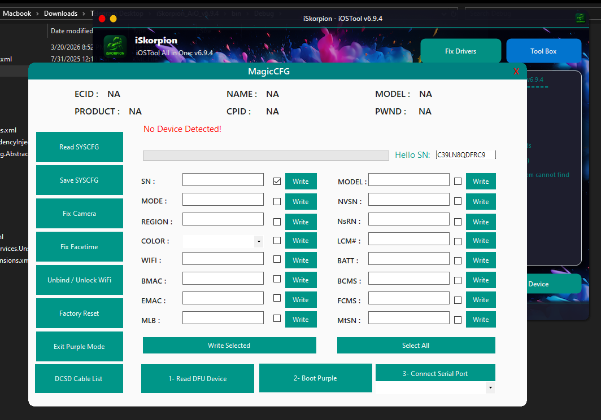
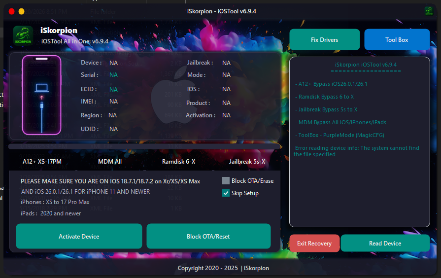

# iSkorpion Tool v6.9.4

Official open-source release of the iSkorpion tool.

## 📌 Overview

Due to unauthorized copies being used by scammers to distribute backdoors and deceive others, I have decided to release the official source code as open source.

## ✨ Features

- **Bypass iOS 7 to iOS 26.1** — No jailbreak required
- **Bypass iOS 12 to 14.5** — GSM iPhones 7 to X with signal
- **Jailbreak Bypass** — iOS 12 to 17
- **Ramdisk Bypass** — iOS 12 to 16
- **Purple Mode** — Magic CFG, Fix Drivers, and more

## 📸 Screenshots

## 🛒 Server Files

Server files are available for purchase. For inquiries, contact me at:

- 🔗 [iSkorpion Admin](https://iskorpion.com/admin)
- 📱 [Telegram](https://t.me/iSkorpionOfficial)
- 🐦 [X (Twitter)](https://x.com/Shetouane)

## ⚠️ Disclaimer

This tool is released for educational and legitimate purposes only. The author is not responsible for any misuse or damages caused by this software.

---

© iSkorpion — Official Source Code